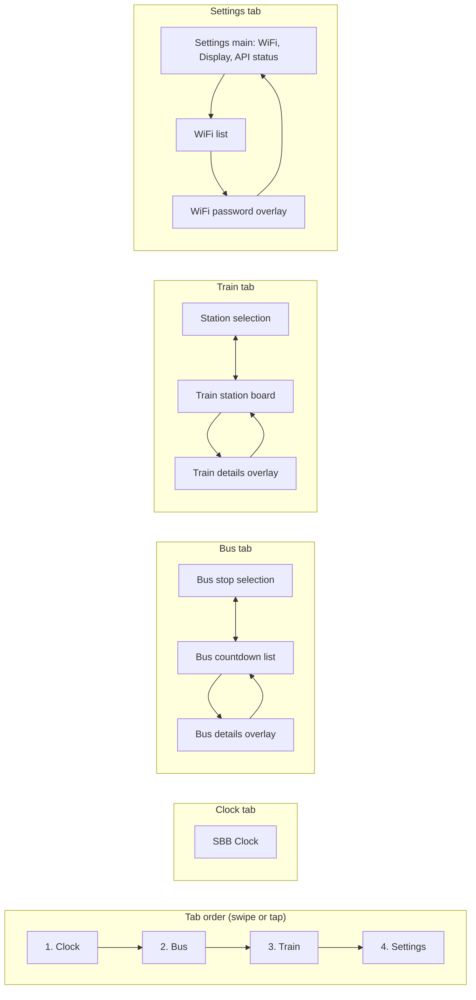

# Public Transport Monitor - Implementation Summary

## Overview

This application implements a comprehensive Public Transport Monitor for the ESP32-S3 SenseCAP Indicator, featuring four main tabs (Clock, Bus, Train, Settings) with smart refresh logic based on time of day.

## Screen flow

The UI uses an LVGL TabView. Tabs are shown in this order: **Clock** → **Bus** → **Train** → **Settings**. Within each tab, sub-screens and overlays are shown as follows:



**Summary:**

| Tab       | Screens / overlays | Navigation |
|----------|--------------------|------------|
| **Clock** | SBB clock (single screen) | — |
| **Bus**   | Stop selection ↔ Countdown list; Details overlay on tap | Back / Prev / Next buttons; Close on details |
| **Train** | Station selection ↔ Station board; Details overlay on tap | Back button; Close on details |
| **Settings** | Main (WiFi, brightness, sleep, API); WiFi list; Password overlay | Open WiFi → list → tap network → password; Apply / Back |

## Architecture

### Core Modules

1. **network_manager** (`model/network_manager.c`)
   - Handles WiFi connection management
   - Provides HTTP GET functionality using `esp_http_client`
   - Manages network status and IP address retrieval
   - Non-blocking HTTP requests with proper buffer management

2. **transport_data** (`model/transport_data.c`)
   - Fetches data from Swiss Public Transport API
   - Parses JSON responses using cJSON
   - Implements smart refresh logic:
     - **Day Mode (06:00-21:59)**: 5-minute refresh interval
     - **Night Mode (22:00-05:59)**: 120-minute refresh interval
   - Supports manual refresh via FAB buttons
   - Filters bus lines and train departures based on configuration

3. **indicator_view** (`view/indicator_view.c`)
   - LVGL-based UI implementation
   - Four tabs: Clock, Bus Countdown, Train Station, Settings (see [Screen flow](#screen-flow))
   - TabView navigation between tabs; sub-screens and overlays within Bus, Train, Settings
   - Real-time updates via event system

### Smart Refresh Logic

The refresh mechanism uses a FreeRTOS timer that dynamically adjusts its period:

```c
// Timer callback adjusts interval based on current time
static void refresh_timer_callback(TimerHandle_t xTimer)
{
    int new_interval = transport_data_get_refresh_interval();
    xTimerChangePeriod(xTimer, pdMS_TO_TICKS(new_interval * 60 * 1000), 0);
    // Fetch data...
}
```

**Key Features:**
- Automatic interval adjustment when transitioning between day/night mode
- Manual refresh bypasses timer and forces immediate update
- Background tasks prevent UI blocking during HTTP requests
- Cached data displayed during API errors

### Data Flow

```
WiFi Connected → Initial Fetch (10s delay)
                ↓
         Refresh Timer Started
                ↓
    ┌───────────┴───────────┐
    ↓                        ↓
Bus API Fetch          Train API Fetch
    ↓                        ↓
JSON Parse             JSON Parse
    ↓                        ↓
Event Posted           Event Posted
    ↓                        ↓
UI Updated             UI Updated
```

### Configuration

Edit `transport_data.h` to customize:

```c
#define BUS_STOP_NAME "Your Stop"
#define BUS_STOP_ID "1234567"
#define TRAIN_STATION_NAME "Your Station"  
#define TRAIN_STATION_ID "8503000"
#define SELECTED_BUS_LINES "1,4,12"
```

### API Integration

**Endpoint:** `http://transport.opendata.ch/v1/stationboard?station={ID}&limit=20`

**Response Format:**
```json
{
  "stationboard": [
    {
      "category": "B",
      "number": "1",
      "to": "Destination",
      "stop": {
        "departure": "2026-01-19T06:15:00+0100"
      },
      "delay": 0
    }
  ]
}
```

**Parsing:**
- ISO 8601 time strings parsed to calculate minutes until departure
- Category filtering (B=Bus, IC/IR/RE/S=Trains)
- Line number filtering for buses
- Delay information extracted for trains

### Error Handling

- **API Errors**: Displayed in red on status labels
- **Parse Errors**: Graceful fallback with error message
- **Network Errors**: Retry logic with exponential backoff
- **Stale Data**: Cached data shown until refresh succeeds

### Memory Management

- HTTP response buffer: 200KB (allocated once)
- JSON parsing: Stack-based (8192 bytes per task)
- UI objects: Managed by LVGL
- NVS storage: WiFi credentials and settings

### Performance Considerations

1. **Staggered Requests**: Bus and train fetches separated by 1 second
2. **Background Tasks**: HTTP requests don't block UI
3. **Smart Caching**: Data cached for 2 hours during night mode
4. **Timer Efficiency**: Single timer handles both bus and train refresh

### SBB Clock Minute Hand Physics

The Swiss Railway (SBB) clock features a realistic damped oscillation effect on the minute hand, simulating the physical behavior of a heavy metal hand with inertia.

#### Algorithm: Damped Harmonic Oscillation

When the minute hand jumps to a new minute position, it doesn't stop immediately but oscillates around the target position before settling, mimicking the mechanical behavior of a real Swiss railway clock.

**Mathematical Model:**
```
displacement(t) = A × e^(-ζt) × cos(ωt)
```

Where:
- `A` = Initial amplitude (-2.4°, backward swing)
- `ζ` = Damping coefficient (8.0, controls decay rate)
- `ω` = Angular frequency (30.0 rad/s, ~4.77 Hz)
- `t` = Time since minute jump (seconds)

**Implementation Details:**

1. **Trigger Detection**: On each timer tick (10ms), the system detects minute transitions:
   ```c
   if (current_minute != last_minute) {
       last_minute = current_minute;
       last_minute_jump_ms = now_ms;  // Reset bounce timer
   }
   ```

2. **Physics Calculation** (active for 500ms after jump):
   ```c
   float t = (now_ms - last_minute_jump_ms) / 1000.0f;
   float bounce = -2.4f × exp(-8.0f × t) × cos(30.0f × t);
   minute_angle = base_angle + bounce;
   ```

3. **Performance Optimization**:
   - Minute hand updates **only during bounce** (first 500ms)
   - After oscillation ends, updates **stop** (saves 99% CPU cycles)
   - No updates for 59.5 seconds until next minute jump

**Oscillation Characteristics:**

| Time (ms) | Amplitude | Visibility | Oscillations |
|-----------|-----------|------------|--------------|
| 0         | 100% (-2.4°) | Full swing backward | 0 |
| 100       | 45% (-1.1°)  | Very visible | 0.5 |
| 200       | 20% (-0.48°) | Visible | 1.0 |
| 300       | 9% (-0.22°)  | Subtle | 1.4 |
| 500       | 2% (-0.04°)  | Imperceptible | 2.4 |

**Result**: The minute hand exhibits approximately **3-4 damped oscillations** over 500ms, creating a natural, mechanical feel that distinguishes it from typical digital clock implementations.

### Future Enhancements

- WiFi credential input via on-screen keyboard
- SmartConfig/WPS support for easier WiFi setup
- Direction filtering for trains
- Favorite lines/stations persistence
- Historical delay statistics
- Multi-language support

## Testing

1. **WiFi Connection**: Verify automatic connection and IP assignment
2. **API Fetching**: Check logs for successful HTTP requests
3. **Refresh Logic**: Verify day/night mode transitions
4. **UI Updates**: Confirm real-time data display
5. **Manual Refresh**: Test FAB button functionality
6. **Error Handling**: Simulate network failures

## Troubleshooting

**WiFi not connecting:**
- Check credentials in NVS
- Verify signal strength
- Check event logs for connection errors

**API errors:**
- Verify station IDs are correct
- Check network connectivity
- Review HTTP response in logs

**UI not updating:**
- Check event system registration
- Verify LVGL task is running
- Review view event handler logs

**Refresh not working:**
- Check timer initialization
- Verify day/night mode detection
- Review transport_data logs
